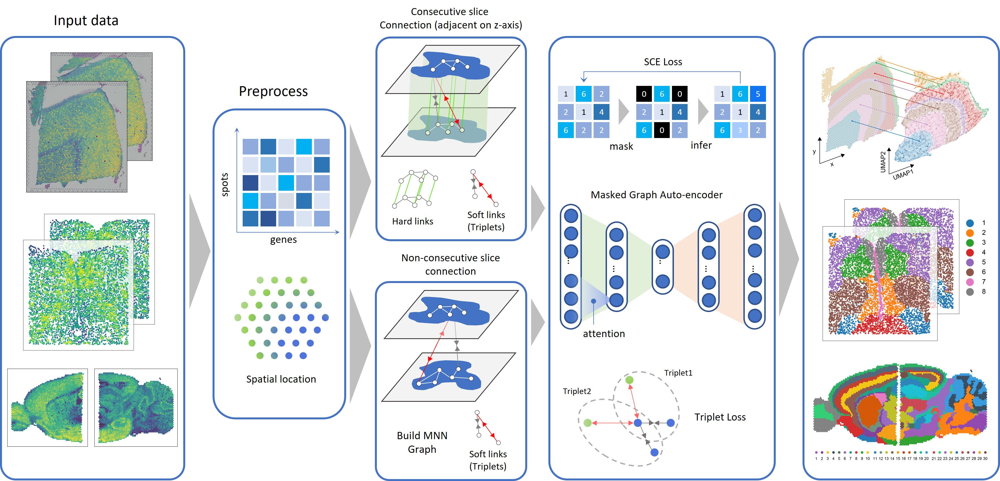

.. MaskGraphene documentation master file, created by
   sphinx-quickstart on Thu Sep 16 19:43:51 2021.
   You can adapt this file completely to your liking, but it should at least
   contain the root `toctree` directive.

MaskGraphene - documentation
=============================================================================

MaskGraphene: Advancing joint embedding, clustering, and batch correction for spatial transcriptomics using graph-based self-supervised learning

.. toctree::
   :maxdepth: 1

   Installation
   Data availability
   Hard link generation
   MaskGraphene on DLPFC
   MaskGraphene on MHypo
   Analyses reproduction
   

Overview
========
With the rapid advancement and generation of spatial transcriptomics (ST), integrating
data from multiple ST slices is increasingly crucial for joint slice analysis. Nevertheless, the tasks of
learning joint embeddings and identifying shared and unique cell/domain types across ST slices re-
main challenging. To address this, we introduce a method called MaskGraphene, for the purpose of
better aligning and integrating different ST slices using both self-supervised and contrastive learn-
ing. MaskGraphene learns the joint embeddings to capture the geometric information efficiently.
MaskGraphene further facilitates spatial aware data integration and simultaneous identification of
shared and unique cell/domain types across different slices. We have applied MaskGraphene to conduct
integrative analyses on various types of ST datasets, including human cortex slices, mouse hypotha-
lamus data, mouse sagittal brain sections, and mouse embryo developmental data. Across datasets,
MaskGraphene successfully optimized joint embedding by introducing inter-slice connections, effec-
tively performing batch correction and capturing shared tissue structures across different slices, and
tracking spatiotemporal changes during mouse embryonic development

Citation
========
Yunfei Hu, etc. "MaskGraphene: Advancing joint embedding, clustering, and batch correction for spatial transcriptomics using graph-based self-supervised learning", currently under review
