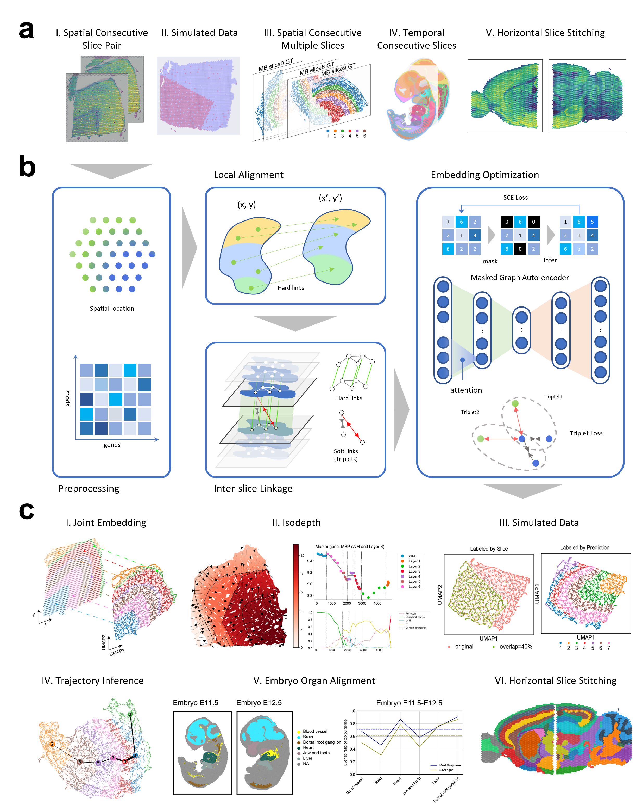

Welcome to MaskGraphene's documentation!
===================================

.. MaskGraphene documentation master file, created by
   sphinx-quickstart on ... .
   You can adapt this file completely to your liking, but it should at least
   contain the root `toctree` directive.

.. MaskGraphene - documentation
.. =============================================================================

MaskGraphene: Advancing joint embedding, clustering, and batch correction for spatial transcriptomics using graph-based self-supervised learning
==================================================================================================

.. toctree::
   :maxdepth: 1

   Installation
   Data availability
   Tutorial 1a_Hard-link generation
   Tutorial 1b_Hard-link generation using PASTE
   Tutorial 1c_Hard-link generation using SPACEL
   Tutorial 2_MaskGraphene on DLPFC
   Tutorial 3_MaskGraphene on MHypo
   Tutorial 4_MaskGraphene on MB
   .. Tutorial 4_MaskGraphene on Embryo
   .. Tutorial 5_MaskGraphene on MB2SA&P
   .. Tutorial 5_Bio analyses
   

Overview
========
With the rapid advancement and generation of spatial transcriptomics (ST), integrating data from multiple ST slices is increasingly crucial for joint slice analysis. 
Nevertheless, the tasks of learning joint embeddings and identifying shared and unique cell/domain types across ST slices remain challenging. 
To address this, we introduce MaskGraphene, for the purpose of better aligning and integrating different ST slices using both self-supervised and contrastive learning. 
MaskGraphene learns the high-quality joint embeddings to capture the geometric information efficiently. 
MaskGraphene further facilitates spatial aware data integration and simultaneous identification of shared and unique cell/domain types across different slices. 
We have applied MaskGraphene to conduct integrative analyses on various types of ST datasets, including human cortex slices, mouse hypothalamus data, mouse sagittal brain sections, and mouse embryo developmental data. 
Across datasets, MaskGraphene successfully optimized joint embedding by introducing inter-slice connections, effectively performing batch correction and capturing shared tissue structures across different slices, and tracking spatiotemporal changes during mouse embryonic development. 
Our experimental results demonstrate that the batch effect is significantly mitigated in the data, validated by the embedding mixture metrics iLISI, while also exhibiting an ideal distribution of the joint embedding in a manner that preserves geometric information and ensures good clustering results and more interpretable downstream analyses.

Citation
========

.. code-block:: bibtex
   
   @article{hu2024maskgraphene,
     title={MaskGraphene: an advanced framework for interpretable latent representation for multi-slice, multi-condition spatial transcriptomics},
     author={Yunfei Hu, Zhenhan Lin, Manfei Xie, Weiman Yuan, Yikang Li, Mingxing Rao, Yichen Henry Liu, Wenjun Shen, Lu Zhang, and Xin Maizie Zhou},
     journal={bioRxiv},
     pages={2024--02},
     year={2024},
     publisher={Cold Spring Harbor Laboratory}
   }
